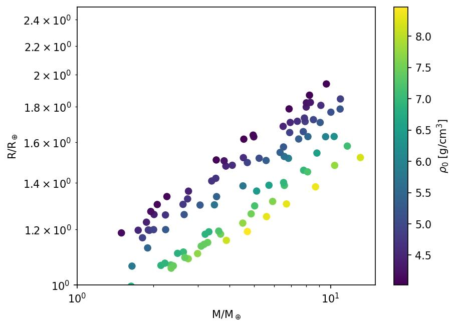
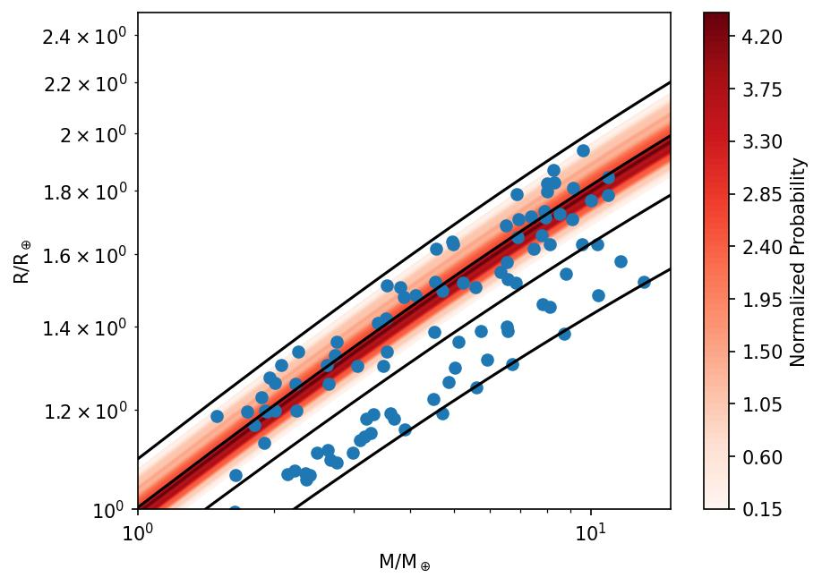

# SuperEarth 

SuperEarth package is an analytical model for apparoximating core mass fraction (cmf `$M_core/M_total$`) and other interior parameters for a Super-Earth sized planet (1-20`$M_e$`), assuming Earth like composition and interior structure.
The analytical function is a fit to a set of generated data using interior structure code which follows [Valencia et al. (2007)](https://iopscience.iop.org/article/10.1086/509800), for more infromation visit [Plotnykov & Valencia (2020)] work.

## Installation

1. Clone the repository

```git clone https://github.com/mplotnyko/SuperEarth.py```

## Example 

In order to approximate cmf one will need Radius and Mass of the planet, as well as assume the iron (`$x_{Fe}$`) amount in the mantle by mol and silica (`$x_{Si}$`) amount in the core by mol. 
For the nominal case one should assume 0.1 `$x_{Fe}$` (`$10\%$`) and 0 `$x_{Si}$`.

Using Earth as a test case, we can compare the CMF to the approximate solution given by f_cmf and assuming nominal case.
For this test case the function performs the best, where the worst case is `$\sim 0.02$`. 
    
    >>> import SuperEarth
    >>> cmf_E = 0.325
    >>> cmf = SuperEarth.f_cmf(1,1,si=0,fe=0.1)
    >>> cmf-cmF_E
    0.0037472894465270246

Once the cmf is know, other useful quentites can be calculated such as the iron to silica refractory ratio (Fe/Si) or the uncompressed density (`$\rho_0$`) of the planet.
For example, using simulated data from structural code ([Plotnykov & Valencia (2020)]), one can calculate the uncompressed denisty.

    import numpy as np
    M,R,CMF = np.loadtxt('data.csv',skiprows=1,delimiter=',').T
    cmf = SuperEarth.f_cmf(M,R,si=0,fe=0.1))
    rho_0 = SuperEarth.f_rho0(cmf,rhoc=8278,rhom=4000)

Where rhoc and rhom are the nominal values for core and mantle density under reference conditions. Here is how the data looks like.



Same procedure can be done to estimate Fe/Si ratio or to use Stellar Fe/Si ratio and convert it to cmf.
For example, assuming some Fe/Si distribtuion for stars and finding the corresponding cmf, we look at distribution of stars given that they are planets. 
Assuming nominal case for the planet composition.

    FeSi = np.random.normal(2,1,500)
    cmf = SuperEarth.star_to_planet(FeSi,si=0,fe=0.1,py=0.6)

Here is the result of such experimnet, where the density plot are converted stars and the points are some simulated planets.


These examples can be found in the example.py file.