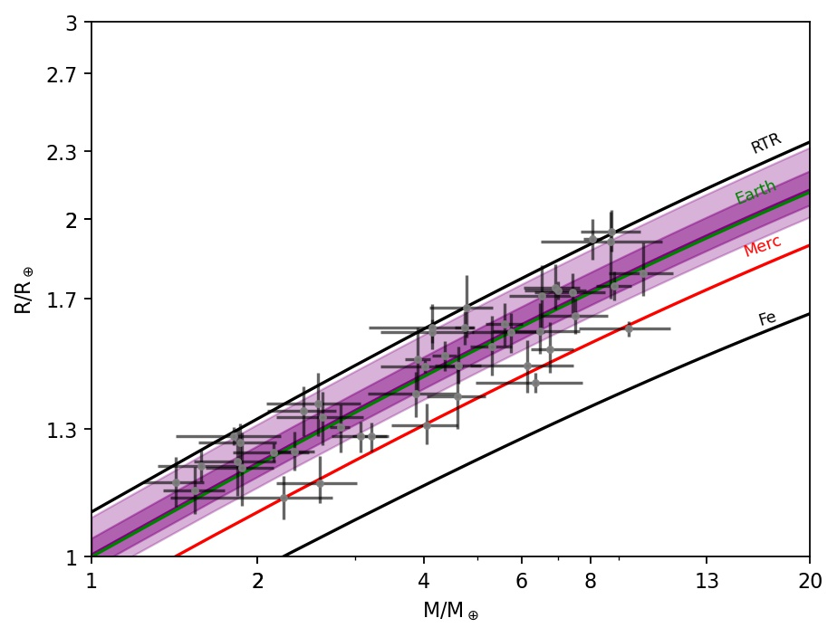

# SuperEarth 

se package has an analytical model that can calculate interior parameters of exoplanets and plot them, plus can plot and query existing exoplanet data using [NASA Exoplanet Archive's TAP service](https://exoplanetarchive.ipac.caltech.edu/docs/TAP/usingTAP.html#PS).
1. The core mass fraction (cmf $M_{core}/M_{total}$) 
2. The refractory ratio of iron to silica Fe/Si (by weight) 
3. Uncompressed  density ($\rho_0$) 4. Radius or Mass, given an estimate for Fe/Si (e.g. host star)  for a rocky Super-Earth planet (1-20$M_e$). 
The functions were obtained assuming a similar mineral content to Earth with major element composition of Mg-Fe-Si-O. 
The analytical function is a fit to a set of generated planetary structures using interior structure code which follows Valencia et al. [(2006)](https://iopscience.iop.org/article/10.1086/509800),[(2007)](https://www.sciencedirect.com/science/article/abs/pii/S0019103505004574), for more information visit [Plotnykov & Valencia (2020)](https://arxiv.org/abs/2010.06480) work.

## Installation

1. pip install from git

```pip install git+https://github.com/mplotnyko/superearth.py```

## Example 

To obtain cmf one will need Radius and Mass of the planet, as well as assume the iron ($x_{Fe}$) amount in the mantle and silica ($x_{Si}$) amount in the core by mol. 
For the nominal case one should assume $x_{Fe}=0.1$ (10%) and $x_{Si}=0$.

Using Earth as a test case, we can compare the CMF to the approximate solution given by f_cmf and assuming nominal case.
For this test case, the function performs the best, where the worst case is $\sim 0.02$. 
    
    >>> import superearth as se
    >>> cmf_E = 0.325
    >>> cmf = se.f_cmf(1,1,si=0,fe=0.1)
    >>> cmf-cmf_E
    0.0037472894465270246

Once the cmf is known, other useful quantities can be calculated such as the iron to silica refractory ratio (Fe/Si) or the uncompressed density ($\rho_0$) of the planet.
For example, using simulated data from structural code ([Plotnykov & Valencia (2020)]), one can calculate the uncompressed density.

    import numpy as np
    M,R,CMF = np.loadtxt('data.csv',skiprows=1,delimiter=',').T
    cmf = se.f_cmf(M,R,si=0,fe=0.1)
    rho_0 = se.f_rho0(cmf,rhoc=8278,rhom=4000)

Where rhoc and rhom are the nominal values for core and mantle density under reference conditions. Here is how the data looks like.


A similar procedure can be done to estimate Fe/Si ratio or to use Stellar Fe/Si ratio and convert it to cmf.
For example, assuming some Fe/Si distribution for stars and finding the corresponding cmf, we look at the distribution of stars given that they are planets. 
Assuming nominal case for the planet composition.

    FeSi = np.random.normal(2,1,500)
    cmf = se.star_to_planet(FeSi,si=0,fe=0.1,py=0.6)

Furthermore, assuming that a planet forms with the same Fe/Si (by weight) ratio and observing its mass (in $M_e$), we can guess the radius (in $R_e$) for such planet.
For example:

    >>> R = se.guess_R(5,2.1,si=0,fe=0.1,py=0.6)
    1.5293039220707563

Here is the result of such an experiment, where the density contour are converted stars and the points are some simulated planets, with solid lines represent cmf = 0, 0.32, 0.67, 1 cases from top to bottom.


Now also supports ploting exoplanets from a NASA Exoplanet Archive, here is an example of only rocky planets.

These examples can be found in the example floder.